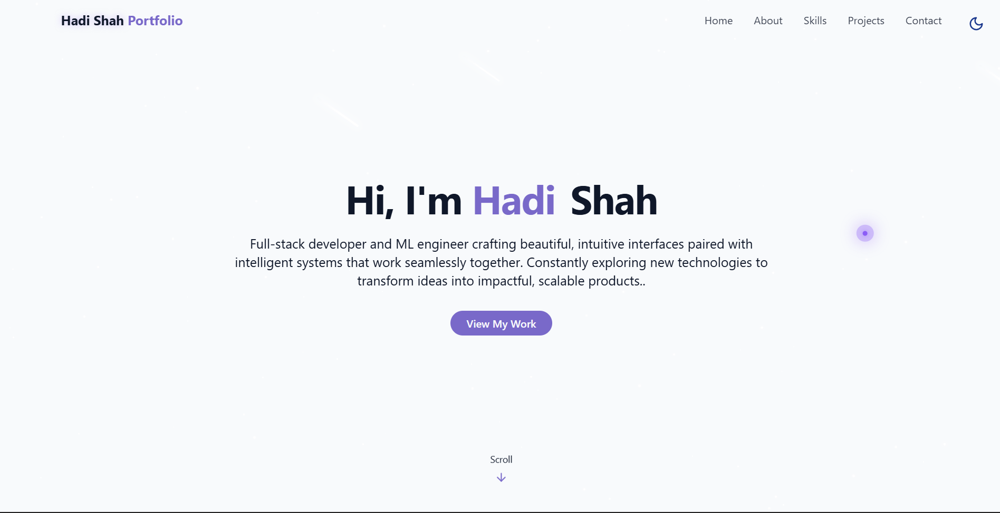

# 🌐 Hadi Shah — Developer Portfolio

> 🚀 React • Vite • Tailwind • Radix UI • Deployed on Vercel

A modern, responsive developer portfolio built to showcase projects, skills, and experience. Designed with performance, accessibility, and clean UI in mind.

---

## 👉 [Live Demo](https://hadishah.vercel.app/)


## 🖼️ Preview




## ⚙️ Tech Stack

* **React** — Component-based UI development
* **Vite** — Lightning-fast build tool
* **Tailwind CSS** — Utility-first styling
* **Radix UI** — Accessible UI primitives
* **Lucide Icons** — Clean and consistent icons
* **Vercel** — Deployment & hosting

---

## ✨ Features

* 📱 Fully responsive design
* 🌙 Dark / Light theme toggle
* 🎯 Smooth scrolling and modern UI
* 🧩 Modular component structure
* 🚀 Optimized performance with Vite
* 🎨 Clean animations & interactive elements

---

## 📁 Project Structure

```bash
my-portfolio
│
├── dist/                # Production build
├── node_modules/        # Dependencies
├── public/              # Static assets
│   ├── logo.png
│   └── projects/
│       ├── project1.png
│       ├── project2.png
│       ├── project3.png
│       └── project4.png
│
├── src/
│   ├── assets/          # Resume & static files
│   │   └── HadiShah_Resume.pdf
│   │
│   ├── components/      # Reusable UI components
│   │   ├── ui/
│   │   ├── AboutSection.jsx
│   │   ├── ContactSection.jsx
│   │   ├── Footer.jsx
│   │   ├── HeroSection.jsx
│   │   ├── Navbar.jsx
│   │   ├── ProjectsSection.jsx
│   │   ├── SkillsSection.jsx
│   │   ├── StarBackground.jsx
│   │   └── ThemeToggle.jsx
│   │
│   ├── hooks/           # Custom hooks
│   ├── lib/             # Utilities/helpers
│   ├── pages/           # Page components
│   │
│   ├── App.jsx
│   ├── main.jsx
│   └── index.css
│
├── index.html
├── package.json
├── vite.config.js
└── README.md
```

---

## 🛠️ Getting Started

### 1. Clone the repo

```bash
git clone https://github.com/hadishah123/my-portfolio.git
cd my-portfolio
```

### 2. Install dependencies

```bash
npm install
```

### 3. Run development server

```bash
npm run dev
```

### 4. Build for production

```bash
npm run build
```

---

## 📬 Contact Information

<table align="center">
<tr>
<td align="center" width="120">
<a href="https://www.linkedin.com/in/hadishah123" target="_blank">

</a><br>
<sub><b>LinkedIn</b></sub>
</td>

<td align="center" width="120">
<a href="mailto:hadishah.work@gmail.com" target="_blank">

</a><br>
<sub><b>Email</b></sub>
</td>

<td align="center" width="120">
<a href="https://www.twitter.com/godking_Ryuma" target="_blank">

</a><br>
<sub><b>Twitter</b></sub>
</td>

</tr>
</table>

---

## 🪪 License

MIT License © 2025 [Hadi Shah](https://github.com/hadishah123)
